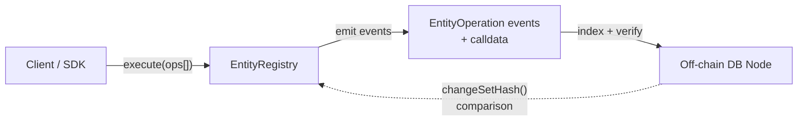
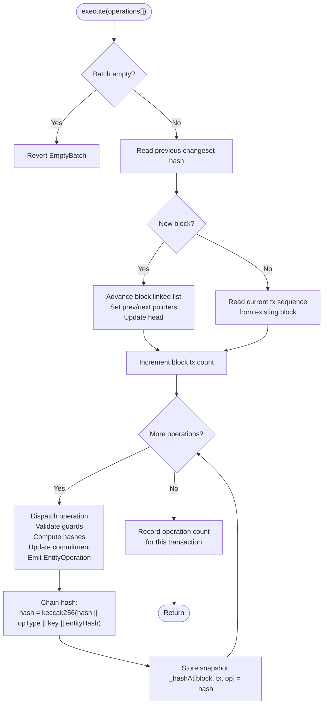
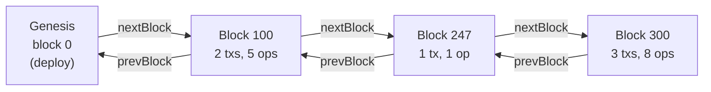
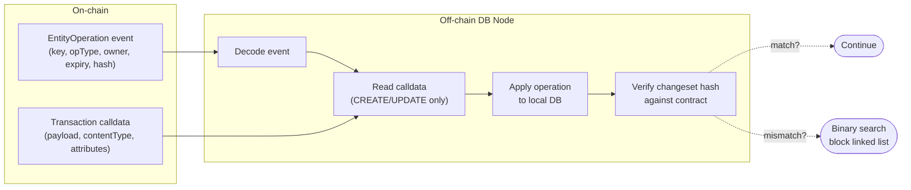

# Arkiv EntityRegistry Architecture

## Overview

The Arkiv EntityRegistry is a smart contract that provides a verifiable
commitment layer for an off-chain database. Entities — content with typed
metadata — are created, modified, and removed through on-chain transactions.
The contract stores only a minimal cryptographic commitment for each entity;
full content lives in transaction calldata and is indexed off-chain by
database nodes.

A rolling changeset hash accumulates every mutation, giving any node a way
to verify its local database against the canonical on-chain state at any
granularity: per-operation, per-transaction, or per-block.



---

## Entity Model

An entity represents a piece of content with structured metadata. Each entity
has an immutable identity (who created it, when, what content) and mutable
lifecycle fields (current owner, expiry).

### Entity Key

Every entity is identified by a globally unique key derived from:

```
entityKey = keccak256(chainId || registryAddress || ownerAddress || nonce)
```

The owner's nonce increments monotonically on each create, guaranteeing
uniqueness without existence checks.

### On-chain Commitment

The contract stores a minimal commitment per entity — enough to recompute
the entity's cryptographic hash from chain state alone:

```
+--------------------------------------------------------------+
| Commitment                                                   |
+--------------------------------------------------------------+
| creator    | address  | who created the entity (immutable)   |
| createdAt  | uint32   | block of creation (immutable)        |
| updatedAt  | uint32   | block of last mutation               |
| expiresAt  | uint32   | block when entity expires            |
| owner      | address  | current owner                        |
| coreHash   | bytes32  | hash of immutable content            |
+--------------------------------------------------------------+
```

### What Is and Isn't Stored On-chain

The contract stores only the commitment fields listed above. Entity
payload bytes, content type, and attributes are **never written to
contract storage** — they exist only in transaction calldata and event
logs. Off-chain database nodes reconstruct the complete entity from
this transaction data.

Content type (128-byte fixed `Mime128`) and attributes (fixed-size
`Attribute` structs) are encoded at fixed widths, so they *could* be
stored on-chain at predictable cost. The current design intentionally
keeps them off-chain to minimise storage gas — the commitment's
`coreHash` already commits to their exact content cryptographically.

### Attributes

Entities carry up to 32 typed key-value attributes. Each attribute has
a validated name (up to 32 bytes) and a fixed 128-byte value container
(`bytes32[4]`). The value container holds different types with
type-specific alignment:

| Value Type   | Encoding in 128-byte container              |
|--------------|----------------------------------------------|
| UINT         | 256-bit unsigned integer in first 32 bytes, remaining bytes zero |
| STRING       | UTF-8 bytes left-aligned across all 128 bytes, zero-padded      |
| ENTITY_KEY   | bytes32 entity key in first 32 bytes, remaining bytes zero      |

The 128-byte fixed size means all attribute values hash at constant cost
regardless of content length, and the `valueType` discriminator prevents
collisions between types (a UINT zero and an empty STRING produce
different hashes).

Attribute names are validated identifiers (`a-z`, `0-9`, `.`, `-`, `_`,
lowercase only, max 32 bytes). They must be sorted ascending by name —
this enforces uniqueness and produces deterministic hashes regardless of
which SDK or language constructs the transaction.

---

## Entity Lifecycle

An entity moves through a defined set of states via six operation types.
All operations are submitted through a single `execute(operations[])` entry
point that accepts batches.

```
                          CREATE
                            │
                            │  caller becomes creator + owner
                            │  entity key minted from nonce
                            v
               ┌─────────────────────────┐
               │         ACTIVE          │
               │                         │
               │  UPDATE ───── replaces  │
               │    payload, contentType,│
               │    attributes           │
               │                         │
               │  EXTEND ───── increases │
               │    expiresAt            │
               │                         │
               │  TRANSFER ─── changes   │
               │    owner (previous      │
               │    owner locked out)    │
               │                         │
               └──────┬─────────┬────────┘
                      │         │
            DELETE    │         │   EXPIRE
          (by owner)  │         │ (by anyone, after
                      v         v  expiry block)
               ┌──────────┐ ┌──────────┐
               │ DELETED  │ │ EXPIRED  │
               │          │ │          │
               │commitment│ │commitment│
               │  zeroed  │ │  zeroed  │
               └──────────┘ └──────────┘
```

### Operations

**CREATE** — Mint a new entity. The caller becomes both creator and owner.
Requires a future expiry block, valid content type, and valid attributes.
The entity key is derived deterministically from the caller's address and
a monotonic nonce.

**UPDATE** — Replace the entity's content (payload, content type,
attributes). Only the owner can update. Does not change ownership or expiry.
The content hash (`coreHash`) is fully recomputed from the new content.

**EXTEND** — Push the expiry further into the future. Only the owner can
extend. The new expiry must be strictly greater than the current one.
Content and ownership are untouched — only `expiresAt` and `updatedAt`
change.

**TRANSFER** — Change the entity's owner. Only the current owner can
transfer. The previous owner loses all access immediately — they cannot
update, extend, delete, or transfer the entity after this point.

**DELETE** — Remove the entity before it expires. Only the owner can delete.
The entity hash is snapshotted for the changeset chain, then the
commitment is zeroed from storage.

**EXPIRE** — Remove an entity that has passed its expiry block. Callable by
anyone — no ownership check. This is a housekeeping operation that reclaims
storage. Like DELETE, the entity hash is snapshotted before removal.

### Access Control

| Operation | Caller must be | Entity must be |
|-----------|---------------|----------------|
| CREATE    | anyone        | (new)          |
| UPDATE    | owner         | active         |
| EXTEND    | owner         | active         |
| TRANSFER  | owner         | active         |
| DELETE    | owner         | active         |
| EXPIRE    | anyone        | expired        |

"Active" means the entity exists and its expiry block has not been reached.

---

## Transaction Flow

All mutations flow through `execute()`, which accepts an array of operations
and processes them atomically.



A single `execute()` call may contain multiple operations. They are
processed sequentially — the changeset hash chains through every operation
in order. If any operation reverts, the entire transaction is rolled back.

---

## Two-Level Entity Hashing

Every entity has a cryptographic hash that commits to its full state.
This hash is computed in two levels using EIP-712 structured data, so
that the inner level (content identity) can be cached and reused when
only the outer level (lifecycle fields) changes.

```
entityHash (EIP-712 domain-wrapped)
│
├── coreHash (immutable, stored on-chain)
│   │
│   ├── entityKey ─────── unique entity identifier
│   ├── creator ──────── who created it (immutable)
│   ├── createdAt ────── block of creation (immutable)
│   ├── contentType ──── MIME type of payload
│   ├── payload ──────── content bytes (calldata only)
│   └── attributesHash ─ rolling hash of all typed attributes
│
├── owner ────────────── current owner (changes on TRANSFER)
├── updatedAt ────────── block of last mutation
└── expiresAt ────────── expiry block (changes on EXTEND)
```

The **coreHash** captures everything about *what* the entity is — its
content identity. It is computed once at CREATE and only recomputed when
content changes (UPDATE). Because payload and attributes live in calldata
(not storage), computing `coreHash` requires the full entity data. The
result is stored in the on-chain commitment so it doesn't need to be
recomputed for operations that don't touch content.

The **entityHash** wraps the `coreHash` with mutable lifecycle fields
and applies the EIP-712 domain separator (chainId + registry address)
to produce the final hash that enters the changeset chain.

### Why two levels?

The split determines what data each operation needs:

| Operation | Needs payload/attributes? | Recomputes coreHash? | Recomputes entityHash? |
|-----------|--------------------------|---------------------|----------------------|
| CREATE    | Yes (from calldata)      | Yes                 | Yes                  |
| UPDATE    | Yes (from calldata)      | Yes                 | Yes                  |
| EXTEND    | No                       | No                  | Yes (new expiresAt)  |
| TRANSFER  | No                       | No                  | Yes (new owner)      |
| DELETE    | No                       | No                  | Snapshot only        |
| EXPIRE    | No                       | No                  | Snapshot only        |

EXTEND and TRANSFER only change lifecycle fields. Because `coreHash` is
already stored in the on-chain commitment, these operations recompute
`entityHash` from storage alone — no calldata content needed, no off-chain
database query. This is the key efficiency the two-level design enables.

UPDATE is the only operation that recomputes `coreHash`, because it
replaces the content entirely. DELETE and EXPIRE snapshot the existing
`entityHash` for the changeset chain before removing the commitment.

---

## Changeset Hash Chain

Every mutation is accumulated into a rolling hash chain. This provides a
single value that commits to the entire history of all entity operations.

```
hash_0 = keccak256(0x00...00 || opType_0 || key_0 || entityHash_0)
hash_1 = keccak256(hash_0   || opType_1 || key_1 || entityHash_1)
hash_2 = keccak256(hash_1   || opType_2 || key_2 || entityHash_2)
  ...
hash_N = keccak256(hash_N-1 || opType_N || key_N || entityHash_N)
```

The chain starts from zero and grows with every operation, across all
transactions and blocks. It never branches or rewinds.

### Three-Level Lookup

Every intermediate hash is stored and queryable at three granularities:

```
changeSetHash() ─── points to head block's last op hash
│
└── Block 100                    changeSetHashAtBlock(100) = hash_e
    │
    ├── Tx 0  (3 ops)            changeSetHashAtTx(100, 0) = hash_c
    │   ├── op 0 → hash_a       changeSetHashAtOp(100, 0, 0)
    │   ├── op 1 → hash_b       changeSetHashAtOp(100, 0, 1)
    │   └── op 2 → hash_c       changeSetHashAtOp(100, 0, 2)
    │
    └── Tx 1  (2 ops)            changeSetHashAtTx(100, 1) = hash_e
        ├── op 0 → hash_d       changeSetHashAtOp(100, 1, 0)
        └── op 1 → hash_e       changeSetHashAtOp(100, 1, 1)
```

Three levels of granularity:

- **Per-operation** — the hash after each individual operation, stored
  directly in the `_hashAt` mapping
- **Per-transaction** — the hash after the last operation in a transaction,
  derived from the per-op snapshot using the operation count
- **Per-block** — the hash after the last transaction in a block, derived
  from the per-tx hash using the transaction count

Transaction-level and block-level hashes are not stored separately — they
are derived from per-operation snapshots using counts. This avoids
redundant storage while keeping all three levels queryable.

### Block Linked List

Only blocks that contain mutations are tracked. A doubly-linked list
connects them for traversal:



Blocks 1–99, 101–246, 248–299 have no entity operations and are not stored.
The linked list enables O(1) forward and backward traversal across only
the blocks that matter. Each node stores `prevBlock`, `nextBlock`, and
`txCount` — enough to navigate the chain and derive hash lookups at any
depth.

---

## Off-chain Database Indexing

The contract is designed so that an off-chain database can reconstruct and
verify all entity state from on-chain data.

### Event-Driven Indexing

Every operation emits an `EntityOperation` event:

```
event EntityOperation(
    bytes32 indexed entityKey,
    uint8   indexed operationType,
    address indexed owner,
    BlockNumber     expiresAt,
    bytes32         entityHash
)
```



### Verification at Any Granularity

A syncing node can verify its state against the contract at three levels:

```
Local DB hash  ==  contract.changeSetHashAtOp(block, tx, op)    exact op
Local DB hash  ==  contract.changeSetHashAtTx(block, tx)        end of tx
Local DB hash  ==  contract.changeSetHashAtBlock(block)          end of block
Local DB hash  ==  contract.changeSetHash()                      current head
```

If a mismatch is detected, the node can binary-search the block linked
list to find the exact point of divergence, then drill down to the
transaction and operation level.

### What Lives Where

| Data                    | On-chain                       | Off-chain              |
|-------------------------|--------------------------------|------------------------|
| Entity existence        | Commitment (3 storage slots)   | Full entity record     |
| Payload bytes           | Calldata only                  | Indexed + queryable    |
| Content type            | Calldata only                  | Indexed + queryable    |
| Attributes              | Calldata only                  | Indexed + queryable    |
| Owner / expiry          | Commitment fields              | Mirrored from events   |
| Content hash            | Commitment.coreHash            | Recomputed + verified  |
| Changeset hash          | Per-op snapshots               | Recomputed + compared  |
| Block traversal         | Linked list + counts           | Event log scanning     |

---

## Determinism Guarantees

The system enforces deterministic hashing across all implementations
through validation at the contract boundary:

- **Attribute names**: Charset restricted to `a-z`, `0-9`, `.`, `-`, `_`.
  No uppercase, no ambiguity.
- **Attribute ordering**: Strict ascending sort enforced on-chain. Same
  attributes always produce the same hash.
- **Content types**: RFC 2045 MIME grammar, lowercase only. `text/plain`
  and `Text/Plain` cannot both enter the system.
- **Identifier encoding**: Left-aligned, zero-padded to fixed widths.
  No trailing garbage bytes.
- **EIP-712 structured hashing**: Industry-standard encoding implemented
  in every major language. No custom serialization.

Any SDK that follows EIP-712 and respects the validation rules will produce
identical hashes to the contract.
