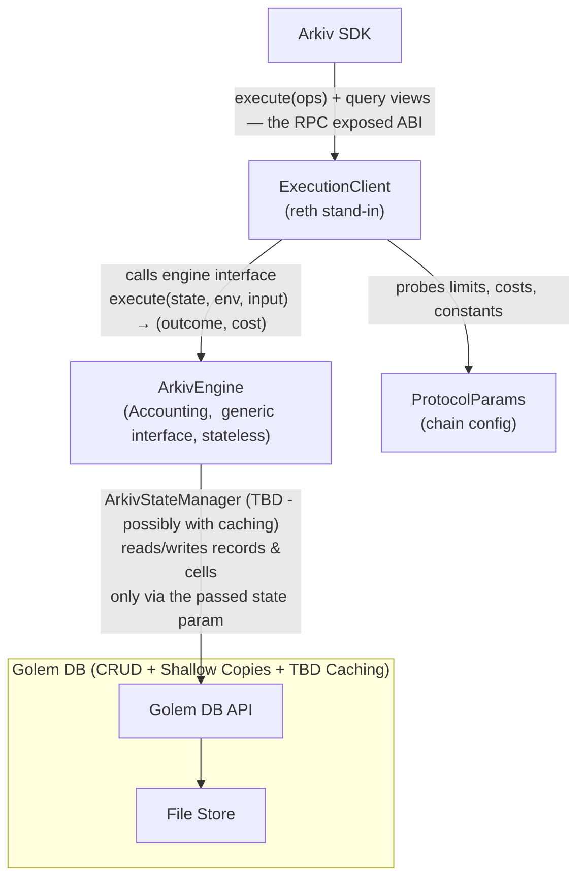

# Arkiv — Types, Ops, Interfaces

## 1. Architecture Overview



Arrows are dependencies. No circular dependencies: the engine knows neither client nor
config contract (values arrive in the env), and the store knows
nothing at all about what runs above it.

Legend — design principles per component:

- **ExecutionClient** — stand-in for the adjusted reth
  client. Binds the tx context (caller, budget, block height, config)
  into the `ExecutionEnv`; this binding is the *only* path into the Arkiv
  engine. Owns the protocol parameter instance and serves query, read and write requests through an RPC;
  storage belongs to Golem DB and is touched only through the ArkivEngine.
  Its ABI — `execute`, views, events, errors — is the entity model's
  contract towards the SDK.
- **ArkivEngine** — all business logic: validation, authorization, key
  derivation, dispatch, cost metering. Abstract and stateless — no
  storage — so everything it touches provably arrives through `(state, env, input)`;
  independence from a specific environment is compiler-enforced.
  Input and outcome are opaque bytes: the engine interface survives a
  different data model (documents, KV, …) with its own codec. 
  Its implementation supports a single specific data model (entity model for V1). 
  Access to state is provided through an abstract RecordStore(PB: ArkivStateManager???) interface, 
  the Arkiv engine itself is unaware of any specific implementation of that store.
- **Golem DB** — the state/storage subsystem: hosts the storage interface
  (RecordStore/RecordReader) and the file store it persists onto. The
  only component above it that touches it is the ArkivEngine.
- **Golem DB API** — generic schemaless data (record/cell) 
  store with zero knowledge of Arkiv Entities.
  It provides following operations:
  - GetDBHash()
  - CREATE
  - - Write (optional PointerToShallowCopy, data, indexes)=>key), 
  - READ Read (optional PointerToShallowCopy, key) => data,
  - - Scan(query)=>result,
  - UPDATE
  - - PATCH (optional PointerToShallowCopy, key, data, index...)
  - DELETE
  - - DELETE (key, indexes)
  - ShallowCopy(param) => PointerToShallowCopy,
  - CommitShallowCopy (pointer)
 
  Whenever CommitShallowCopy is executed or WriteOpera

  To discuss: Should writes be possible only through shallow copies, or direct writes should be also possible?
  
  Maintains state, provides shallow copies, caching, file persistence etc.
  Enforces structural invariants only. 
- **File Store** — persistence layer beneath the record store; the
  record store maps records and cells onto it. 
- **ProtocolParams** — statically declared chain config: limits,
  record store and Arkiv engine operation cost parameters. 

## 2. Attribute Types

Entity attribute type set; wire encoding is standard ABI/Solidity for every
tag. Value-length bounds (string ≤ 128 B, `$payload` ≤ 128 KiB,
index caps) are validation rules, not encoding variants — enforced
against the active `ProtocolParams` limits.

| typeId | new | type | ABI type | indexing | comments |
|---|---|---|---|---|---|
| 1 | X | `bool` | `bool` | equality | |
| 2 | X | `int` | `i32` | equality + range | default signed int |
| 3 | X | `u256` | `u256` | equality + range | needs casting |
| 4 | X | `decimal` | `i256` | equality + range | fixed 18 decimals |
| 5 | X | `bytes32` | `bytes32` | equality only | |
| 6 |   | `bytes` | `bytes` | none — system-only (`$payload`) | |
| 7 |   | `string` | `string` limited to 128 bytes | equality + prefix | |
| 8 | X | `ethereum_address` | `address` | equality only | |
| 9 | X | `entity_key` | `bytes32` | equality only | |

- **Encoding boundary**: the ABI types above specify the
  *wire* only. Internal representations (attribute cells, index
  keys, the `$entityHash` preimage) may diverge and are pinned
  later with state epoch 1 + the corpus September slice. Known
  divergence: `int` is re-encoded sign-bit-biased internally so byte
  order = numeric order (range scans).
- References are **weak** by spec: no existence check at write, no
  delete restriction, dangling permitted.
- **Grammars are spec items (TBD)**: user attribute names and
  `$contentType` values each come from a defined character subset with
  specific rules.

## 3. Entity Ops, attributes & mutations

Dedicated lifecycle entity ops; all content mutation is one generic `patch`. 

| opId | op | signature | one-liner |
|---|---|---|---|
| 1 | `create` | `(btl, creation_flags, attributes[])` | mint key + set initial attributes |
| 2 | `patch` | `(key, mutations[])` | partial patch, owner-only |
| 3 | `extend_expiry` | `(key, btl)` | **anchored at now** (`expires_at = now + btl`), not additive — retry-idempotent |
| 4 | `transfer_ownership` | `(key, newOwner)` | ownership; zero/self checks |
| 5 | `delete` | `(key)` | owner-only, active entities; expired entities are removed by the protocol |

- **Creation flags**: one byte with 8 bit flags, V1 comes with readonly and permissionless extension (6 flags reserved for protocol upgrades)
- **Attributes at create, mutations at patch — one wire shape**: both
  lists are ordered `(name, typeId, value)` triples, strictly
  ascending by name, duplicates rejected. The two names reflect what
  each list is allowed to do:
  - **Attributes (`create`) can only set**: each triple creates a
    user attribute or sets a system key (incl. `$payload`).
    Tombstones are disallowed — on a fresh entity there is nothing to
    unset, so "absent" is expressed by omission (canonical encoding:
    one way to say absent); a tombstone in `create` is a typed
    revert.
  - **Mutations (`patch`) set and unset**: each triple sets a user
    attribute or system key, or unsets one by tombstone.
- **Entity lifetime** - TODO for  `create`/ `extend_expiry`: come 
  up with a good proposal that covers both relative (current impl) 
  and absolute block numbers for expiriy.
- **Naming precedent** — the set-only/data vs set-and-unset/
  instruction split is the universal DB convention: DynamoDB
  `PutItem` (`Item` = "map of attribute name/value pairs") vs
  `UpdateItem` (`SET`/`REMOVE` actions); MongoDB `insert(document)`
  vs `update($set/$unset)`; for `patch` specifically, the
  wide-column data APIs (Google Bigtable
  `MutateRow(key, mutations[])` with `SetCell`/delete, HBase
  `Mutation`).
- **Tombstone**: `(name, 0, "")` — under `valueType = 0` the only
  valid value is the empty byte string; anything else is a typed
  revert (canonical encoding, no malleability).
- **Expiry is a predicate; reaping is protocol-controlled and
  unobservable**: an entity is expired iff `expiresAt <= current`
  (last live block = `expiresAt - 1`, a pinned invariant). Expired
  entities become invisible to queries and reject every op — this
  transition happens by block progression alone, no op, no event.
  Physical removal (reaping) is performed by the protocol,
  deterministic and budgeted per block (bounded work under expiry
  bombs); external accounts cannot trigger it. There is deliberately
  **no reap event**: reaping may lag expiry, so such an event would
  fire at reclaim time and mislead — apps derive liveness from the
  indexed `expiresAt` on `EntityCreated`/`ExpiryExtended` (the SDK
  synthesizes expiry notifications offchain). Formally: state =
  `active(N)`, storage = `records(N) ⊇ active(N)`; reaping is an
  abstract no-op that only touches records outside `active(N)`.
  Supersedes the earlier GC-bot model (deletable-by-anyone).
- **Cost ∝ change**: a `patch` of k mutations costs k touches — no
  O(entity) floor on any mutation; lost-update races disappear
  (partial patches compose).
- **Enumeration is part of the surface**: the registry maintains a
  strictly-ascending list of set custom attribute names per entity,
  queryable via the `customAttributeNames(entityKey)` view (plus
  `attributeTypeId(entityKey, name)` point lookups). Values are not
  chain-queryable — they live in the DB layer, reconstructed from
  calldata by sorted merge (create list + patch deltas).

## 3. Batch execution

One external entry point: `execute(ops[])`. A transaction is an
ordered, atomic batch of entity ops. This section explains how 
a transaction maps to a sequence of entity ops.

| aspect | rule |
|---|---|
| batch | `execute(ops[])`, `ops.length ≥ 1`; empty batch reverts |
| atomicity | any op reverting rolls back the whole batch — no partial application |
| ordering | ops apply strictly in array order; op *n+1* observes op *n*'s effects |
| granularity | one array element = one op; a `patch` of k mutations is **one** op (k is cost, not sequence) |
| auth | per-op, against `msg.sender` (owner checks) — no batch-level auth |
| events | one event per applied op, in application order — the off-chain DB replays batches op-by-op |

- **Wire shape (tagged union)**: each op is
  `(operation, operationData)`, where `operationData` is the ABI
  encoding of the per-op payload struct selected by `operation`
  (`Create`, `Patch`, …). Attributes and mutations share one
  `(name, typeId, value)` triple encoding; the payload field names
  carry the terminology. Unknown tags are a typed revert, not a
  skip — and new op types extend the protocol without changing the
  `execute()` signature. The protocol demands canonical encoding of
  `operationData`.
- **Same-batch composition**: `create` mints its key from the caller's
  nonce, so a later op in the same batch can target a just-created
  entity by precomputing `entityKey(owner, nonce)` client-side —
  ordering guarantees it exists by then.
- **Mixed batches are supported**: any combination of entity ops, any
  number of distinct entities, including the same entity touched more
  than once — each op sees the state left by its predecessors.

## 4. Record Store (proposal)

The engine's state/storage interface is a generic record/cell store with
zero entity knowledge — Arkiv's entity model is one data model on top
of it. A record is a set of named, typed cells,
enumerable in strictly ascending name order.

| aspect | rule |
|---|---|
| record | unique `bytes32` key (engine-supplied — key derivation is business logic; the store only guards collisions) |
| key cell | every record starts with one reserved cell `#key` — always first (`#` sorts before all permitted names); its presence *is* record existence; its typeId slot carries the **recordType** tag |
| cell | `(name, typeId, value)` — typeId and value opaque to the store; unique non-reserved names per record, sorted strictly ascending |
| ops | records: `createRecord(key, recordType)` / `readRecord` / `deleteRecord`; cells: `getCell` / `putCell` / `removeCell` |
| read side | `RecordReader` (reads only) split from `RecordStore` (adds engine-gated mutators) — read-only access as a compile-time capability |
| record types | one opaque byte, 0 = undefined; Arkiv assigns `entity` / `account` (nonces) / `index` and asserts the tag before interpreting a record — typed guard against key confusion (single-table-design discriminator) |
| business logic | everything else: name grammar, the `$` system namespace, per-entity caps, auth, value encodings — engine-side, never store-side |

- **Entity mapping**: an entity is a record; the commitment lives as
  system cells (`$owner`, `$creator`, `$createdAt`, `$updatedAt`,
  `$expiresAt`, `$creationFlags`) beside `$payload`, `$contentType`,
  and the custom attributes. Counters (`payloadSize`,
  `customAttributes`) are derived, not maintained. Per-owner nonces
  are ordinary `account` records — a second data model in the same
  store.
- **Metering at the store boundary**: the meter charges per store
  op plus per value byte (`write_costs`); duration-dependent pricing
  (btl-proportional storage cost) is business logic in the engine's
  create/extend handlers (**open**).
- **Indexes ride on sorted keys** (HBase pattern): index entries are
  records whose *keys* encode the index — and may be
  key-cell-only records. Requires a future ordered-scan *read* op on
  the storage interface; native KV storage like MDBX provides sorted-key 
  iteration for free, and the write path is unchanged (**open**).
- **HBase/Bigtable lineage**: the design is a wide-column store —
  record ≈ HBase *row*, cell = HBase *cell* (their exact API term),
  the `#`/`$`/custom name prefixes play the role of *column families*,
  and `putCell`/`removeCell` mirror the `SetCell`/`DeleteCell`
  mutations of `MutateRow` — the same lineage the wire's
  `patch(key, mutations[])` naming comes from. Deliberate
  divergences: cells are single-versioned (no timestamps — history
  lives in events/blockchain storage layer), access is point-only,
  cells carry one byte of opaque typing ("typed CSV"; an untyped model
  just tags everything `bytes`), and the record key is materialized as
  the key cell. Vocabulary note: *cell* follows the wide-column lineage,
  *record* the CSV/record-store lineage — chosen over HBase's *row* to
  avoid relational connotations.

## 5. Concrete SDK surface: `execute(ops)`

The single TX entry point the Arkiv SDK targets — one transaction is
one atomic batch of entity ops (strict execution order, all-or-nothing,
one event per applied op). 
The definitions below are (almost) the live ABI from the reference 
`ExecutionClient.sol`, `ArkivEngine.sol`, `RecordStore.sol`, etc.

```typescript
/// SDK-facing ABI interface.
/// @return keys the entity key created/affected by each op.
function execute(Operation[] calldata ops)
    external
    returns (EntityKey[] memory keys);

/// Tagged union: `operation` selects the payload struct that
/// `operationData` ABI-decodes to. Canonical encoding required.
struct Operation {
    uint8 operation;     // CREATE=1 PATCH=2 EXTEND_EXPIRY=3
                         // TRANSFER_OWNERSHIP=4 DELETE=5
    bytes operationData; // abi.encode(<payload struct below>)
}

struct Create {
    uint32 btl;             // blocks-to-live, > 0; expiresAt = current + btl
                            // TODO provide absolute and relative options
    uint8 creationFlags;    // bit0 readonly, bit1 permissionless_extension,
                            // bits 2-7 reserved (must be zero)
    Attribute[] attributes; // strictly ascending by name; no tombstones
}

struct Patch {
    EntityKey entityKey;
    Attribute[] mutations;  // strictly ascending; tombstones allowed; non-empty
}

struct ExtendExpiry {
    EntityKey entityKey;
    uint32 btl;             // new expiresAt = current + btl; must strictly increase
                            // TODO provide absolute and relative options
}

struct TransferOwnership {
    EntityKey entityKey;
    address newOwner;       // non-zero and != current owner
}

struct Delete {
    EntityKey entityKey;    // owner-only, active entities
}

/// The one wire shape shared by attributes (create) and mutations (patch).
struct Attribute {
    Ident32 name;  // user grammar: leading a-z, then a-z 0-9 . - _
                   // system names: $payload (bytes), $contentType (string)
    uint8 typeId;  // 0 tombstone | 1 bool | 2 int(i32) | 3 u256
                   // 4 decimal(i256) | 5 bytes32 | 6 bytes ($payload only)
                   // 7 string (<= 128 B) | 8 address | 9 entity_key
    bytes value;   // ABI encoding selected by typeId: exact 32-byte word
                   // for word types, raw bytes for string/bytes
}
```

Client-side key derivation (for same-batch composition — create, then
patch the predicted key):

```solidity
entityKey = keccak256(abi.encodePacked(domain, owner, nonce));
// domain: chain-config constant (ProtocolParams.DOMAIN)
// nonce:  per-owner counter, queryable via nonces(owner)
```

Beyond `execute`, the SDK-facing ABI comprises the query views
(`query`, `nonces`, and account reading functions), the five per-op events
(`EntityCreated`, `EntityPatched`, `ExpiryExtended`,
`OwnershipTransferred`, `EntityDeleted`), and the typed errors — all
defined in `Entity` / `ExecutionClient` and stable 1:1 across
implementations.

---

*A note for readers familiar with hexagonal architecture: the layering
here is ports and adapters — the engine interface and the storage
interface are its ports, the execution client is the adapter layer —
and you should feel right at home. The codebase deliberately uses the
concrete names instead of the pattern vocabulary.*
