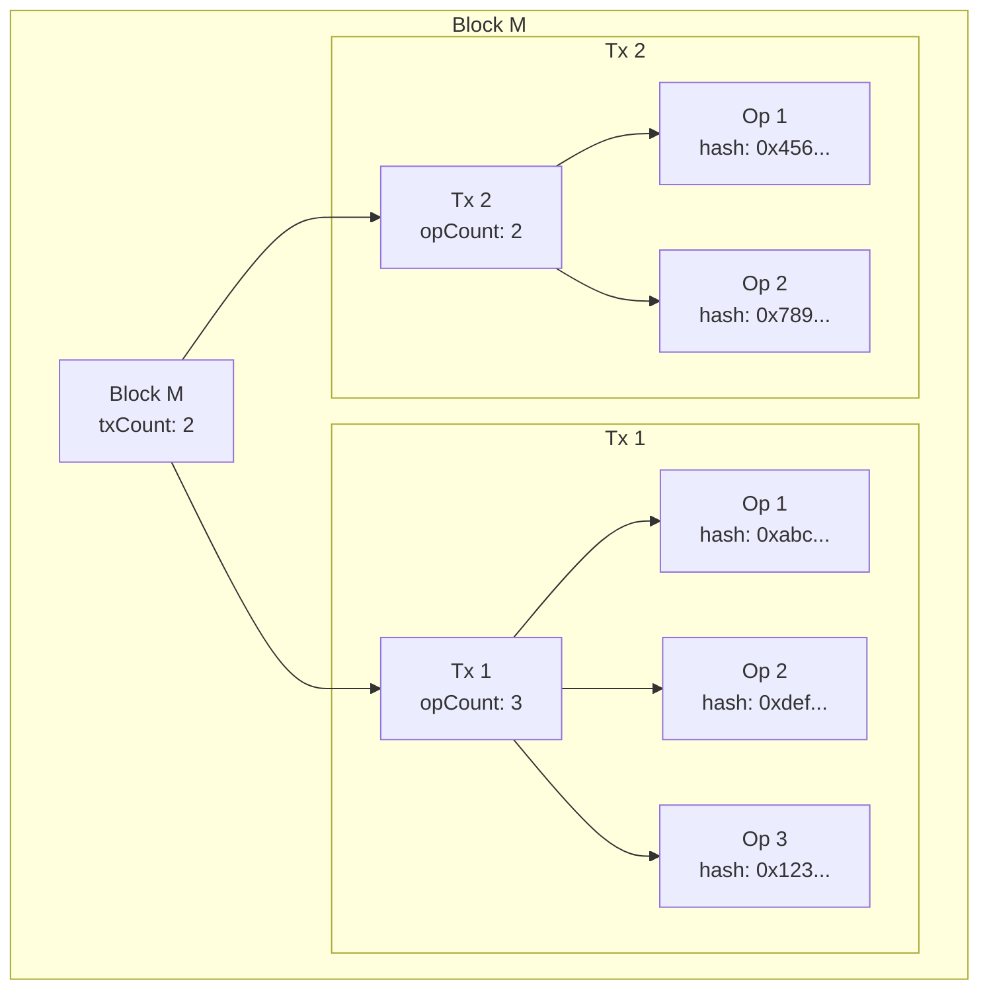
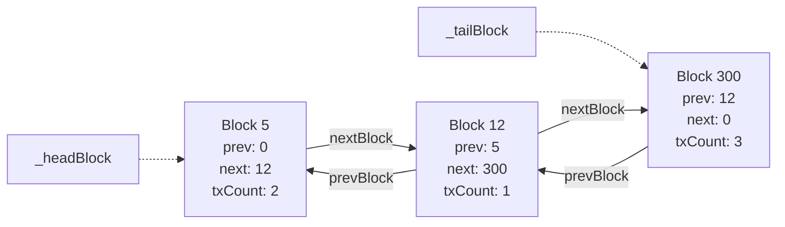
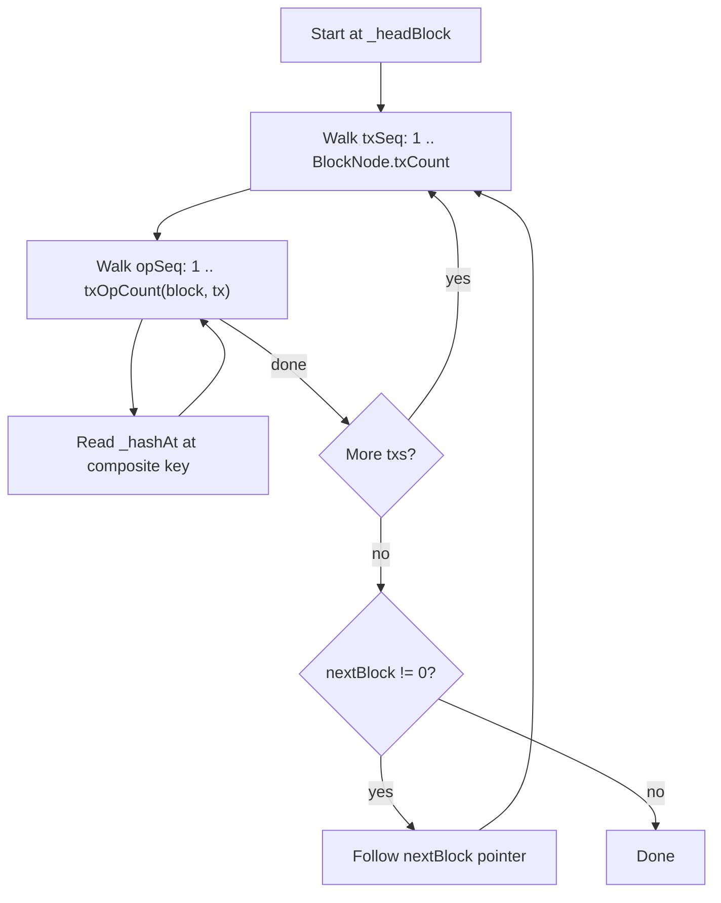
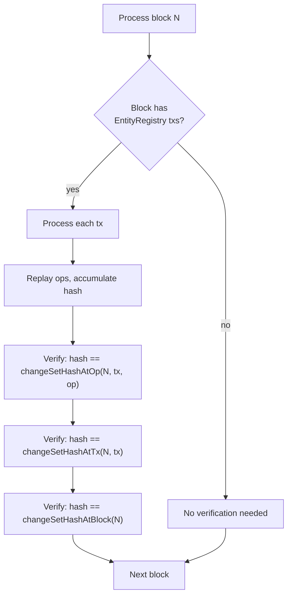

# Change Set Hash (V3)

## Summary

V3 extends the change set hash from a single running accumulator (V1) or per-block snapshots (V2) to a **three-level lookup table** with a **block-level linked list**, enabling O(1) verification at block, transaction, and individual operation granularity.

This design targets Arkiv's rollup architecture where storage costs are negligible, making the straightforward approach the correct one.

## Evolution

### V1: Single Accumulator

A single `bytes32` chaining every mutation. Simple, cheap, always up to date. But only verifiable at "latest" -- no historical queries without archive state.

### V2: Per-Block Snapshots

Added a `mapping(blockNumber => bytes32)` with lazy finalization to avoid paying SSTORE on every mutation within a block. Introduced `_lastMutationBlock` for block boundary detection. The lazy finalization added complexity (the "one block behind" problem) and a conditional view function.

### V3: Three-Level Lookup with Block Linked List

Stores the changeset hash after every individual operation. Tx-level and block-level hashes are derived from the per-op snapshots via counts, eliminating redundant writes. A doubly-linked list over blocks with mutations enables traversal across sparse block ranges.

## Architecture

### Three-Level Hierarchy



Each level's hash is the changeset hash after all operations at that scope:

- **Op-level**: stored directly in `_hashAt[(block << 64) | (tx << 32) | op]`
- **Tx-level**: derived as the last op's hash in that tx
- **Block-level**: derived as the last op of the last tx in that block

### Block Linked List

Only blocks containing entity mutations have entries. The linked list enables O(1) forward and backward traversal without scanning empty blocks.



- `prevBlock == 0` on the head node: start of chain
- `nextBlock == 0` on the tail node: end of chain
- `_headBlock` and `_tailBlock` are packed into the same storage slot as the tx/op counters (24 bytes total), so they cost no additional SSTORE

### Composite Key Encoding

All per-op hashes live in a single `mapping(uint256 => bytes32)`. The key encodes position:

```
bits:  [255 ........... 64] [63 ......... 32] [31 .......... 0]
field:     blockNumber          txSeq              opSeq
```

`(blockNumber << 64) | (txSeq << 32) | opSeq`

Navigation counts stored separately:
- `BlockNode.txCount`: number of txs in a block
- `_txOpCount[(block << 32) | txSeq]`: number of ops in a specific tx

### Traversal



## Smart Contract Design

### State Variables

```solidity
// Per-op changeset hash snapshots (composite key)
mapping(uint256 => bytes32) internal _hashAt;

// Per-tx op count: (blockNumber << 32) | txSeq => count
mapping(uint256 => uint32) internal _txOpCount;

// Block linked list nodes
mapping(uint256 => BlockNode) internal _blocks;

// Packed cursor (single slot, 24 bytes):
uint64 internal _headBlock;      // first mutation block
uint64 internal _tailBlock;      // most recent mutation block
uint32 internal _currentTxSeq;   // tx counter in current block
uint32 internal _currentOpSeq;   // op counter in current tx
```

### Eliminated State

V3 removes several state variables present in earlier versions:

- **`_changeSetHash`** (V1, V2): derived from `_hashAt` using the packed cursor
- **`_changeSetHashAtBlock` mapping** (V2): derived from per-op snapshots via counts
- **`_lastMutationBlock`** (V2): replaced by `_tailBlock` in the packed cursor
- **Tx-level and block-level snapshot entries** in `_hashAt`: derived, not stored

### Query Interface

```solidity
// Current cumulative hash (derived from packed cursor)
function changeSetHash() public view returns (bytes32);

// Hash at specific granularity
function changeSetHashAtBlock(uint256 blockNumber) public view returns (bytes32);
function changeSetHashAtTx(uint256 blockNumber, uint32 txSeq) public view returns (bytes32);
function changeSetHashAtOp(uint256 blockNumber, uint32 txSeq, uint32 opSeq) public view returns (bytes32);

// Navigation
function headBlock() public view returns (uint64);
function tailBlock() public view returns (uint64);
function getBlockNode(uint256 blockNumber) public view returns (BlockNode memory);
function txOpCount(uint256 blockNumber, uint32 txSeq) public view returns (uint32);
```

### Batch Execution

All entity mutations flow through `execute(Op[] calldata ops)`. Each call is one transaction containing one or more operations:

```solidity
function execute(Op[] calldata ops) external {
    // 1. Read previous hash from per-op mapping (before counter mutation)
    // 2. Block transition: update linked list if new block
    // 3. Advance tx sequence, update BlockNode.txCount
    // 4. For each op:
    //      - dispatch to _create/_update/_extend/_transfer/_delete/_expire
    //      - accumulate hash: keccak256(hash || opType || key || entityHash)
    //      - store per-op snapshot: _hashAt[compositeKey] = hash
    // 5. Record _txOpCount, update _currentOpSeq
}
```

### Operation Types

| Op | Requires Content | Mutates coreHash | Mutates Mutable Fields |
|----|-----------------|------------------|----------------------|
| CREATE | yes | creates | creates |
| UPDATE | yes | replaces | updatedAt |
| EXTEND | no | -- | expiresAt, updatedAt |
| TRANSFER | no | -- | owner, updatedAt |
| DELETE | no | -- | removes entity |
| EXPIRE | no | -- | removes entity |

Operations that don't require content (EXTEND, TRANSFER, DELETE, EXPIRE) recompute `entityHash` from the stored `coreHash` and on-chain metadata alone.

## SSTORE Cost Analysis

Per `execute()` call with N ops:

| Write | Count | Notes |
|-------|-------|-------|
| `_hashAt[op key]` | N | one per op (irreducible) |
| `_txOpCount` | 1 | op count for this tx |
| `BlockNode.txCount` | 1 | packed slot, replaces separate mapping |
| Packed cursor | 1 | `_tailBlock`, `_currentTxSeq`, `_currentOpSeq` in one slot |
| **Same-block total** | **N + 3** | |
| `BlockNode` (prev block's nextBlock) | +1 | only on block transition |
| **New-block total** | **N + 4** | |

### Comparison Across Versions

For one transaction with N ops entering a new block:

| Version | SSTOREs | Historical Lookup | Traversal |
|---------|---------|-------------------|-----------|
| V1 | N + 1 | none | none |
| V2 | N + 3 | per-block | none |
| V3 | N + 4 | per-op | O(1) linked list |

V3 is +1 SSTORE over V2 on block transitions (the linked list pointer), while providing per-op granularity and full traversal — capabilities V2 cannot offer.

### Storage Costs Relative to Payload Calldata

The SSTORE overhead of V3 is negligible compared to the calldata cost of entity payloads. An entity with a 120KB payload costs approximately 1.9M gas in calldata alone (120,000 bytes * 16 gas/byte). The entire V3 bookkeeping for that operation — one per-op snapshot SSTORE (~5k gas warm), plus amortized tx/block overhead — is under 10k gas, less than 0.5% of the calldata cost.

Even in a batch of small entities, calldata dominates. The `Op` struct itself (opType, entityKey, contentType, attributes, payload) contributes far more gas in calldata encoding than the storage writes that track it. On Arkiv's rollup where gas pricing is controlled, this ratio is even more favourable — the storage costs for per-op snapshots and the block linked list are effectively free relative to the data the operations carry.

This is why V3 doesn't optimise for fewer SSTOREs at the cost of complexity (as V2 did with lazy finalization). The straightforward approach — store everything, derive what you can — is the correct design when storage is a rounding error on the payload.

## Commitment Depth

The changeset hash transitively commits to every field of every entity through the EIP-712 hash structure:

```
changeSetHash
|-- previous changeSetHash          <-- full history of all prior mutations
|-- opType                          <-- mutation type (CREATE, UPDATE, EXTEND, TRANSFER, DELETE, EXPIRE)
|-- entityKey                       <-- identity of the entity being mutated
+-- entityHash                      <-- EIP-712 hash of the entity's full state
     |-- coreHash                   <-- EIP-712 hash of immutable entity content
     |    |-- entityKey
     |    |-- creator
     |    |-- createdAt
     |    |-- contentType
     |    |-- keccak256(payload)
     |    +-- keccak256(attributeHashes[])
     |         +-- per attribute:
     |              |-- name
     |              |-- valueType
     |              |-- fixedValue
     |              +-- keccak256(stringValue)
     |-- owner
     |-- updatedAt
     +-- expiresAt
```

## Verification

### Syncing Node

A syncing node processes blocks sequentially and verifies at each level:



### Divergence Recovery

If a mismatch is detected, the three-level hierarchy narrows the search:

1. Binary search on blocks (via linked list) to find the diverging block
2. Walk txs within that block to find the diverging tx
3. Walk ops within that tx to find the exact diverging operation

## Comparative Analysis: Events vs Storage

An alternative approach stores nothing on-chain beyond the running hash and emits events for each operation. Here is how the two approaches compare.

### Event-Based Design

```solidity
event ChangeSetAccumulated(
    bytes32 indexed entityKey,
    OpType opType,
    bytes32 entityHash,
    bytes32 changeSetHash
);

// Only the running hash in storage
bytes32 internal _changeSetHash;
```

The DB reconstructs per-op, per-tx, and per-block hashes from event logs. No on-chain lookup table, no linked list.

### Cost Comparison

For one transaction with N ops:

| | Storage (V3) | Events |
|---|---|---|
| Per-op write | 1 SSTORE (~5k gas warm) | 1 LOG2 (~1.4k gas) |
| Per-op total | ~5k | ~1.4k |
| Per-tx overhead | 3 SSTOREs (~15k) | 1 SSTORE (~5k for `_changeSetHash`) |
| **N ops total** | **~5N + 15k** | **~1.4N + 5k** |
| Historical query | `eth_call` (O(1), no archive) | `eth_getLogs` (requires log index) |
| Traversal | O(1) linked list | sequential log scan |
| Block-level lookup | derived from counts | derived from log block metadata |
| Works without archive node | yes | yes (logs are retained) |

### When Events Are Sufficient

Events are the better choice when:

- **The node runs its own execution client** and verifies at execution time (the DB has access to contract state at each block height during sync)
- **Per-op on-chain lookup is not needed** by external tools or light clients
- **Gas cost matters** even on the rollup (e.g., DA costs on an L2 that posts to L1)
- **Log infrastructure is reliable** and log queries are fast

### When Storage Is Worth It

The V3 storage approach is preferable when:

- **External verification without replay** is needed (auditors, light clients, cross-chain bridges can call `changeSetHashAtOp` directly)
- **Traversal across sparse blocks** is needed without scanning logs
- **Gas is negligible** (Arkiv's own rollup with controlled gas pricing)
- **The on-chain state should be self-describing** without depending on log availability or indexing infrastructure

### Hybrid Approach

Both can coexist. Emit events for the DB component (cheap notification mechanism) while also storing per-op snapshots for on-chain queryability. The events add ~1.4k gas per op on top of V3's storage costs — negligible on a rollup. This gives the DB fast event-driven processing while preserving full on-chain verifiability for external consumers.
