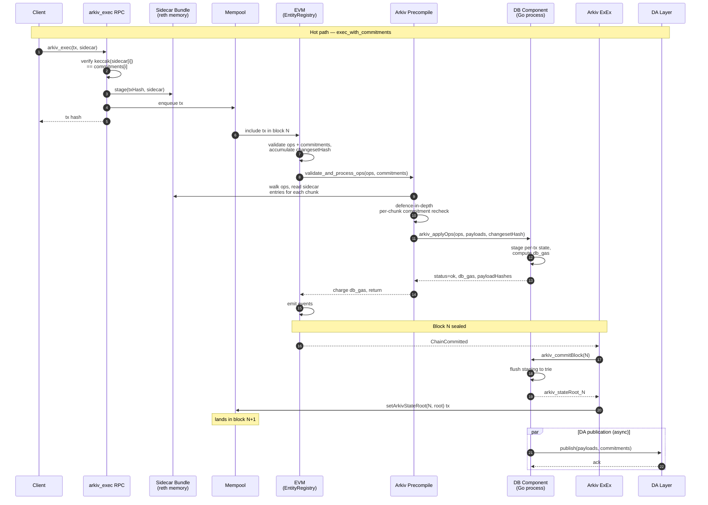
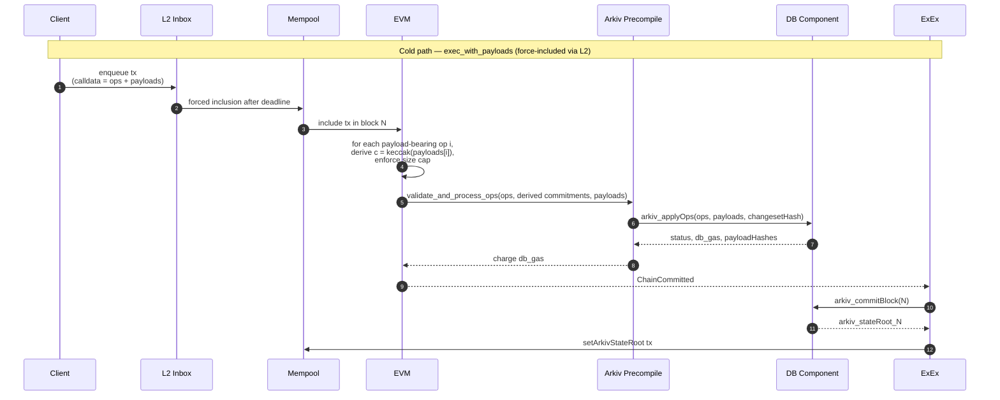

# Response: Sidecar + Commitment Model for Arkiv EntityDB

## Contents

- [Abstract](#abstract)
- [1. Relationship to the Original Spec](#1-relationship-to-the-original-spec)
- [2. Sidecar Transport and Commitment Model](#2-sidecar-transport-and-commitment-model)
- [3. Data Flow](#3-data-flow)
- [4. Tiered Entry Points](#4-tiered-entry-points)
- [5. Op Struct and Vocabulary](#5-op-struct-and-vocabulary)
- [6. Property Decomposition](#6-property-decomposition)
- [7. Witness Proofs and Challenge Games](#7-witness-proofs-and-challenge-games)
- [8. Reth Integration Points](#8-reth-integration-points)
- [9. Open Questions](#9-open-questions)
- [10. Migration Path](#10-migration-path)
- [11. Summary](#11-summary)

---

> **Status.** This is a design response to the Arkiv EntityDB precompile + ExEx
> specification. It builds on the throughput analysis in
> `payload-commitment-analysis.md` and proposes a refinement of the data
> path. Does not supersede the original spec — most of it is preserved.

---

## Abstract

The Arkiv EntityDB spec gets the four-component architecture
(contract / precompile / ExEx / DB) right, and the failure semantics are
well-considered. The one bottleneck it leaves untouched is **calldata
cost**: per the throughput analysis, ~99% of `execute()` gas on a
payload-bearing operation is calldata for the payload bytes themselves. A
127 KB CREATE costs ~2.1M gas today, ~5.25M under EIP-7623 floor pricing.
None of that gas pays for state work — it pays for moving bytes through
the EVM that the EVM never reads.

This document proposes a refinement that decouples payload bytes from the
EVM-visible portion of the transaction. Payloads travel as a transport-level
sidecar, attached at RPC ingress and never entering calldata. Calldata
carries only fixed-size commitments (one `bytes32` per payload). The
Arkiv precompile reads sidecar bytes via reth-provided execution-context
data (modelled on EIP-4844's `BLOBHASH` mechanism) and forwards ops plus
bytes to the DB component in a single call. The contract surface gains
three named entry points sharing a single `Op` struct, distinguished by
how payload bytes reach the precompile (sidecar vs calldata vs none). The
ExEx and DB component are unchanged from the original spec.

The result is a system that delivers three independently useful properties
through three independent mechanisms:

- **Integrity** — keccak commitments in signed calldata bind the chain to
  specific payload bytes; anyone holding the bytes can verify them.
- **Data availability** — provided by an external DA layer (Celestia,
  EigenDA, or a DAC), not by calldata.
- **Censorship resistance** — provided by a tiered entry-point design
  where one path admits payloads in calldata for forced inclusion via the
  L2 inbox.

A fourth property — **execution correctness** — is left to future work
and not provided by this design alone. The commitment scheme is the
foundation on which any future fraud-proof or validity-proof system would
build.

Headline outcomes:

- ~99% calldata gas reduction on the hot path (per the throughput
  analysis, ~39k gas vs ~2.1M for a 127 KB CREATE).
- The three properties above can be shipped independently, in any order.
- No fundamental change to the precompile / ExEx / DB factoring of the
  original spec; the changes are confined to the contract surface, the
  reth ingress path, and the `Op` struct.

---

## 1. Relationship to the Original Spec

### What this response preserves

- Four-component architecture: EntityRegistry contract, Arkiv precompile,
  Arkiv ExEx, Go DB component.
- Three-state precompile result (`ok` / `revert` / `fatal`) and
  halt-on-fatal semantics.
- ExEx-driven block lifecycle with deferred `arkiv_stateRoot` submission
  in block N+1.
- Reorg handling via PathScheme reverse diffs and PebbleDB journal replay.
- Validator and archive node profiles.
- Two-level proof chain (entity → `arkiv_stateRoot` → L3 stateRoot at
  block N+1).
- The DB component's internal storage model: `arkiv_payload`,
  `arkiv_longstr`, `arkiv_bm`, `arkiv_attr`, `arkiv_id`, `arkiv_addr`,
  `arkiv_pairs`, `arkiv_exp`, `arkiv_root`, `arkiv_journal`.
- Bitmap GC, journal pruning, retention window.
- Responsibility matrix from §11 of the original (with adjustments noted
  in §8 of this document).

### What this response changes

- `Op` struct: `bytes payload` is removed. Commitments and payload bytes
  are decoupled from `Op` entirely and travel as parallel arguments to
  the entry points. `Op` carries only operation metadata.
- Contract surface: a single `execute()` becomes three named entry points
  (§4) sharing internal dispatch. Hot path supports chunked commitments
  per op (`bytes32[][]`); cold path uses a single bytes blob per op
  (`bytes[]`).
- Calldata gas cost on the hot path drops by ~99% on payload-bearing ops.
- Precompile interface: a single `validate_and_process_ops` call replaces
  the previous `applyOps` shape; sidecar reads become an internal
  capability of the precompile rather than a separately exposed surface.
- New transport-level concept: a per-block sidecar bundle staged at RPC
  ingress.
- DA story is moved out of the contract surface entirely; it lives at the
  DAL/DAC integration layer (§6.2).

### What remains open and unchanged

- DB gas charging model (folded vs separate value transfer; original
  §12).
- ExEx submission tx delivery mechanism (mempool vs privileged system tx).
- Halt-state recovery semantics on fatal conditions.
- `MAX_ATTRIBUTES` calibration and storage cost analysis.

---

## 2. Sidecar Transport and Commitment Model

### 2.1 Stripping at RPC ingress, not at EVM execution

Payload bytes are removed from the EVM-visible portion of the transaction
at **RPC ingress** — before the transaction enters the mempool or the
block builder. Stripping mid-execution (rewriting calldata in a
pre-execution hook) is rejected here on principle: it breaks the EVM
property that calldata is what the signer signed, and it pushes
determinism complexity into the executor for no benefit.

A new RPC method `arkiv_exec` accepts the transaction and its sidecar as
separate fields:

```json
{
  "method": "arkiv_exec",
  "params": [{
    "tx":      "0x...",
    "sidecar": {
      "payloads": ["0x...", "0x...", "..."]
    }
  }]
}
```

At ingress, the sequencer's reth node:

1. Decodes the transaction; recovers the signer.
2. Decodes the operation batch from calldata.
3. For each declared commitment `c[i]`:
   - Asserts `keccak256(sidecar.payloads[i]) == c[i]`.
   - On mismatch: rejects the RPC call. The transaction is never
     enqueued.
4. Stages the sidecar in a block-scoped sidecar bundle, keyed by tx hash.
5. Hands the transaction to the mempool / block builder.

By the time the transaction reaches EVM execution, the binding between
calldata commitments and sidecar bytes is already established by the RPC
layer. The Arkiv precompile re-verifies as defence in depth (§2.4) but
relies on the ingress check for the authoritative reject path.

### 2.2 What is signed

Standard EVM signature semantics are unchanged. The signer signs the
transaction including its calldata, and the calldata contains the
commitments. The sidecar is not part of the signed envelope — but because
the RPC rejects any submission whose sidecar doesn't match the committed
hashes, the signer's signature transitively binds the sidecar bytes via
the commitments.

This is the same model as EIP-4844: the transaction signs over
`blob_versioned_hashes`; sidecar blobs must match those hashes; nothing
additional is signed.

### 2.3 Commitment scheme

For v0: `commitment = keccak256(payload)`. Cheap, no trusted setup,
universally available, sufficient for the integrity properties described
in §6.1.

For future upgrade: KZG (EIP-4844-style),
`commitment = versioned_hash(KZG_commit(payload))`. Adds:

- Cheap **partial opens** via the point-evaluation precompile — useful
  for fraud-proof games disputing a chunk of a payload without revealing
  the full payload on-chain.
- Native compatibility with EIP-4844 blob posting if Arkiv ever lands
  payload data on Ethereum L1 directly.
- Path to data-availability sampling if the sequencer set ever
  decentralizes.

The commitment format should be **versioned from day one**. Reserve the
leading byte of each `bytes32` commitment for a scheme tag:

- `0x00` — keccak256(payload)
- `0x01` — KZG-versioned hash (future)

This costs nothing today (the commitment is `bytes32` either way, and the
contract treats commitments as opaque) and eliminates a wire-format break
when KZG is added later. The contract does not interpret the version
byte; only RPC ingress and any future challenge mechanism need to.

### 2.4 Sidecar access from the precompile

Reth makes the per-transaction sidecar available to the Arkiv precompile
via execution-context data, modelled on EIP-4844's `BLOBHASH` mechanism.
The precompile reads:

- The commitment for sidecar entry `i` (a `bytes32`).
- The byte length of sidecar entry `i`.
- The total sidecar entry count.
- The bytes themselves for entry `i`, when forwarding to the DB component.

This is **not exposed as a separate `SidecarReader` precompile**. There
is one consumer (the Arkiv precompile) and no general use case for other
contracts on the L3 to read sidecars. Folding sidecar access into the
Arkiv precompile keeps the reth-side surface narrow and avoids a
public-facing read interface that would be meaningless from any other
caller.

The defence-in-depth check the Arkiv precompile performs (full chunked
form in §5.4):

```text
sidecarOffset = 0
for each payload-bearing op[i]:
  for j in 0 .. commitments[i].length:
    assert sidecar.commitment(sidecarOffset + j) == commitments[i][j]
  sidecarOffset += commitments[i].length
assert sidecarOffset == sidecar.count()
```

This is one comparison per chunk (commitments are already cached by
reth from ingress; no rehashing needed). It catches bugs in the
ingress validation, the sidecar bundle, or the contract's commitment
forwarding without measurable cost.

---

## 3. Data Flow

### 3.1 Hot path — `exec_with_commitments`



Key points:

- Steps 2–3 happen at the RPC layer; the mempool only ever sees the slim
  transaction with commitments.
- Step 9 (sidecar bytes reaching the precompile) does not cross the IPC
  boundary into the DB until step 10 — the bytes are forwarded as part
  of the `arkiv_applyOps` request body.
- Steps 14–18 are the deferred state-root anchoring, identical to the
  original spec's ExEx behaviour.
- DA publication runs asynchronously; block sealing does not wait on DA
  acknowledgement in v0 (see §9 q1).

### 3.2 Cold path — `exec_with_payloads`



Key differences from the hot path:

- No sidecar at all — bytes are in calldata.
- No `arkiv_exec` RPC; the transaction can be submitted via standard
  paths or via the L2 inbox for forced inclusion.
- The contract performs the commitment check (step 4) before invoking
  the precompile; the precompile does not re-verify because the bytes
  came from calldata, not a separate channel.

### 3.3 Metadata-only path

`exec_metadata_only` is the cold path minus payloads: the contract
rejects any payload-bearing op, then dispatches `Op[]` directly to the
precompile, which forwards to the DB without any payload data. No
diagram needed — the flow is the cold path with steps 4 and any
payload-related work elided.

---

## 4. Tiered Entry Points

The contract exposes three named entry points. They share validation
logic and dispatch through a single internal `_exec_internal` after
resolving the byte source for each op.

### 4.1 `exec_with_commitments(Op[] ops, bytes32[][] commitments)` — hot path

Default path. Expected to carry ~99% of traffic.

- `commitments[i]` is the chunk list for `ops[i]`. Empty for metadata
  ops; one or more entries for payload-bearing ops.
- `commitments.length == ops.length` (dense; see §5.1).
- Each chunk corresponds to one sidecar entry; addressing is implicit
  positional with a running offset (§5.4).
- Bytes live in the sidecar; the precompile reads them via the
  reth-provided sidecar context.
- Cheap (~39k gas per CREATE per the throughput analysis), independent
  of payload size.
- Fast.
- Per-op chunk count capped at `MAX_CHUNKS_PER_OP` (§5.1) — bounds
  on-chain validation cost while still admitting multi-MiB entities.
- **Sequencer-cooperation required**: the transaction cannot be
  force-included from L2 because the sidecar is not part of the signed
  transaction. Forced inclusion via the L2 inbox would deliver only the
  calldata, with no sidecar to match against.

### 4.2 `exec_with_payloads(Op[] ops, bytes[] payloads)` — cold path

Censorship-resistance escape hatch.

- `payloads[i]` is the raw byte string for `ops[i]`. Empty bytes for
  metadata ops; non-empty for payload-bearing ops.
- `payloads.length == ops.length` (dense; see §5.1).
- **One commitment per op, no chunking.** The contract derives
  `c = keccak256(payloads[i])` for each payload-bearing op and
  internally constructs `commitments[i] = [c]`. Chunking inline bytes
  buys nothing; the bytes are already contiguous in calldata.
- Per-op size capped at `MAX_COLD_PATH_BYTES_PER_OP` (§5.1) — bounds
  the worst-case calldata cost on the L2 inbox.
- Expensive (~2M gas per CREATE for 127 KB payload, dominated by
  calldata cost — same as today).
- **Self-contained**: the entire transaction can be force-included via
  the L2 inbox; no sidecar dependency.

Large entities (above the cold-path cap) are hot-path only. Forced
inclusion has a natural size ceiling dictated by L2 calldata gas
budgets; this design surfaces the ceiling explicitly rather than
leaving it as a gas-driven implicit limit.

This path exists specifically for cases where the sequencer is censoring
a user's transaction. It is **not** a data-availability mechanism — DA is
provided by the DAL/DAC integration described in §6.2. The fact that
cold-path bytes also end up in L2 calldata as part of the L3's batch is
incidental and should not be marketed as DA.

### 4.3 `exec_metadata_only(Op[] ops)` — metadata-only path

Always cheap, always force-includable.

- Accepts only `SetAttributeOp`, `DeleteAttributeOp`, `DeleteOp`,
  `ExtendOp`, `ChangeOwnerOp`. Reverts if the batch contains any
  payload-bearing op.
- No sidecar reads, no payload arguments.
- Lower gas pricing tier possible (chain parameter).
- Useful for tools and integrations that never produce payloads
  (housekeeping, batch attribute updates, lifecycle ops), and for
  force-including metadata operations during sequencer outages without
  paying calldata cost for payload bytes that don't exist.

### 4.4 Internal dispatch

The three entry points converge on a single internal call to the
precompile after normalising their inputs to a uniform shape:

```text
_exec_internal(ops, commitments, payloads_or_null):
  // commitments always populated:
  //   hot path  — supplied by caller
  //   cold path — derived from keccak256(payloads[i]) per op
  //   metadata  — empty inner arrays everywhere
  // payloads_or_null:
  //   hot path  — null (precompile reads from sidecar)
  //   cold path — supplied by caller
  //   metadata  — null
  precompile.validate_and_process_ops(ops, commitments, payloads_or_null, changesetHash)
```

Consequences:

- The precompile receives a uniform shape regardless of entry point.
- Mixed batches within a single entry point may include metadata ops
  alongside payload-bearing ones (already true in the original spec).
- Adding a future entry point (e.g., one that supports KZG commitments
  alongside keccak) does not require changes to internal dispatch.
- Cross-entry-point batches (some via sidecar, some via calldata) are
  not supported in v0. The entry point selects the byte source for all
  payload-bearing ops in the batch. A genuine mix can use two
  transactions.

### 4.5 Naming

The external names should communicate the *guarantee*, not the
*mechanism*. Suggested final names (subject to bikeshedding):

- `exec` — hot path.
- `exec_durable` or `exec_anchored` — cold path.
- `exec_metadata` — metadata-only path.

`exec_with_payloads` is technically descriptive but invites the
misreading that it is somehow faster because "the payloads are right
there". Users will reach for it for the wrong reason. Naming around the
property (durability / anchoring) avoids this.

---

## 5. Op Struct and Vocabulary

### 5.1 A single, shared `Op` struct

All three entry points use the same `Op` struct. **Commitments and
payload bytes are decoupled from the struct entirely** — they travel as
parallel arguments alongside `ops`, indexed positionally. `Op` carries
only operation metadata that every entry point needs.

```solidity
type LongString is bytes32;  // keccak256 commitment to a string ≤256 bytes

struct Op {
    uint8        opType;        // CREATE, UPDATE_PAYLOAD, SET_ATTR, ...
    bytes32      entityKey;     // 20-byte address padded to 32; zero on CREATE
    LongString   contentType;   // commitment to MIME string; full value in DB
    Attribute[]  attributes;    // type-tagged attribute entries
    uint64       expiresAt;
    address      newOwner;      // CHANGE_OWNER only
}

// Hot path: bytes live in sidecar; commitments declared per-op, chunked.
function exec_with_commitments(
    Op[]        calldata ops,
    bytes32[][] calldata commitments    // commitments[i] is chunk list for ops[i]
) external;

// Cold path: bytes live in calldata; one bytes blob per op (no chunking).
function exec_with_payloads(
    Op[]    calldata ops,
    bytes[] calldata payloads           // payloads[i] is bytes for ops[i]
) external;

// Metadata-only: rejects payload-bearing ops; no commitments, no payloads.
function exec_metadata_only(Op[] calldata ops) external;

// Chain parameters (subject to calibration; see §9).
uint256 constant MAX_CHUNKS_PER_OP          = 256;          // 32 MiB per entity at 128 KiB chunks
uint256 constant MAX_COLD_PATH_BYTES_PER_OP = 128 * 1024;   // 128 KiB; matches natural blob size
```

**Why decoupled:**

- `Op` is shared across all three entry points. Putting commitment data
  on `Op` would force metadata ops to carry zero fields they never use,
  and would make `Op`'s shape vary by path.
- Hot path needs many commitments per op (chunked); cold path needs one
  bytes blob per op (unchunked). Parallel arrays match the actual user
  input shape.
- On the cold path, commitments are derived not supplied — putting them
  on `Op` would be misleading.
- `entityHash` composition is purely a function of `(metadata, commitments)`
  and never of raw bytes (§5.4), so commitments are fundamentally
  output-side data rather than input metadata.

**Dense outer arrays.** Both `commitments` and `payloads` are required
to satisfy `length == ops.length`. Empty entries (zero-length inner
arrays / empty bytes) for non-payload-bearing ops. Calldata overhead is
~32 bytes per empty entry — negligible against the indexing
simplification.

**Validation rules** the contract enforces before dispatch:

```text
for each op[i] in ops:
  if isPayloadBearing(op[i].opType):
    hot path:  require commitments[i].length >= 1
               require commitments[i].length <= MAX_CHUNKS_PER_OP
    cold path: require payloads[i].length > 0
               require payloads[i].length <= MAX_COLD_PATH_BYTES_PER_OP
  else:
    hot path:  require commitments[i].length == 0
    cold path: require payloads[i].length == 0
```

### 5.2 Which ops are payload-bearing

| Op                  | Payload-bearing | Allowed in `exec_metadata_only` |
|---------------------|:---------------:|:-------------------------------:|
| `CreateOp`          | Yes             | No                              |
| `UpdatePayloadOp`   | Yes             | No                              |
| `SetAttributeOp`    | No (longString values are commitments; full value in DB) | Yes |
| `DeleteAttributeOp` | No              | Yes                             |
| `DeleteOp`          | No              | Yes                             |
| `ExtendOp`          | No              | Yes                             |
| `ChangeOwnerOp`     | No              | Yes                             |

Only two ops carry payloads. The hot/cold-path distinction therefore
applies to two operations, not the whole vocabulary. Five of seven ops
are unconditionally cheap and force-includable.

### 5.3 Mixed batches

A single `exec_with_commitments` call may contain `CreateOp`,
`UpdatePayloadOp`, and any metadata ops in any combination, with the
parallel `commitments` array carrying empty inner arrays for the
metadata ops. Same shape on the cold path with `payloads` carrying
empty bytes for metadata ops. Entry-point boundaries are not crossed
within a single batch.

### 5.4 Sidecar indexing and `entityHash` composition

**Sidecar indexing on the hot path.** The sidecar is a flat array of
entries. Each payload-bearing op consumes a contiguous slice sized by
its chunk count. The precompile walks ops with a running offset:

```text
sidecarOffset = 0
for each op[i] in ops:
  if isPayloadBearing(op[i].opType):
    for j in 0 .. commitments[i].length:
      assert sidecar.commitment(sidecarOffset + j) == commitments[i][j]
      // collect bytes from sidecar.payload(sidecarOffset + j)
    sidecarOffset += commitments[i].length
  // else: no sidecar interaction

assert sidecarOffset == sidecar.count()    // no extras, no shortfall
```

The trailing equality check ensures no sidecar entries are smuggled in
and no declared chunks are missing — the same invariant 4844 enforces
on blob counts.

**`entityHash` composition.** `entityHash` is a function of
`(metadata, commitments[])`, **never** of raw payload bytes. The same
logical entity created via the hot path (1 chunk, 1 commitment) and the
cold path (single bytes blob → derived 1-element commitment list)
produces the same `entityHash`, because the contract sees the same
commitment sequence in both cases. Cold-path bytes never participate in
the hash directly.

For multi-chunk hot-path entities, the commitment list is the
authoritative record. Reordering, omitting, or substituting any chunk
produces a different `entityHash`.

---

## 6. Property Decomposition

Four orthogonal properties, four independent mechanisms. Each can be
reasoned about and shipped independently. None of them depend on the
others to deliver their property.

```text
   integrity              ← keccak commitments + sidecar match
   data availability      ← DAL / DAC (Celestia, EigenDA)
   censorship resistance  ← cold-path entry + L2 inbox
   execution correctness  ← future: fraud proofs or validity proofs
```

### 6.1 Integrity — commitments

**Provided by:** keccak commitments in signed calldata; sidecar match
enforced at RPC ingress.

**Gives:**

- The chain is bound to specific payload bytes.
- Anyone holding the bytes can verify them against the on-chain
  commitment.
- Tampering with stored bytes is detectable on re-fetch.
- Equivocation (sequencer serving different bytes to different parties)
  produces a publishable proof of misbehaviour.

**Does not give:** data availability, execution correctness.

**Status:** deliverable in v0 with the design in §2–§4.

### 6.2 Data Availability — DAL / DAC

**Provided by:** external DA-layer integration — Celestia, EigenDA, or a
Data Availability Committee.

**Mechanism:**

- Sequencer publishes payload bytes to the DA layer alongside (or as
  part of) block production.
- DA-layer commitment is recorded on-chain or referenced by an existing
  on-chain commitment.
- Any party can retrieve bytes from the DA layer independent of the
  sequencer.

**Gives:**

- "Anyone with the data" stops being conditional on sequencer
  cooperation.
- Bytes remain retrievable for the DA layer's retention period.
- Integrity proofs (§6.1) become genuinely useful — there is reliable
  data to challenge against.

**Does not give:** execution correctness, censorship resistance.

**Status:** integration work; not part of the contract surface. Layered
on top of v0 without contract changes.

### 6.3 Censorship Resistance — cold path + L2 inbox

**Provided by:** `exec_with_payloads` (and `exec_metadata_only`) plus
the L3's L2-inbox forced-inclusion mechanism.

**Mechanism:**

- User submits the transaction to the L2 inbox.
- L2 inbox enqueues the transaction for L3 inclusion.
- L3 protocol enforces inclusion within a deadline; the sequencer cannot
  drop it.
- Transaction is self-contained: no sidecar dependency.

**Gives:**

- Guaranteed eventual inclusion of payload-bearing operations even when
  the sequencer is hostile or unresponsive.
- Operation lands on-chain with correct commitments and reaches the DB
  component when the sequencer next produces a block.

**Does not give:** data availability beyond what DAL/DAC provides;
execution correctness; recovery for entities whose bytes the sequencer
has already served and discarded.

**Status:** depends on the rollup stack's forced-inclusion
implementation. Contract surface is ready; protocol integration is a
separate workstream.

### 6.4 Execution Correctness — future

**Not provided** by this design.

To deliver execution correctness on top of the commitments, two
ingredients are required:

- **Reliable data availability** (which DAL/DAC provides) so challengers
  can replay disputed blocks.
- **A proving system** — fraud proofs (Optimism / Arbitrum-style) or
  validity proofs (ZK) — that takes (prior state root, transaction
  batch, payload bytes) and produces (next state root)
  deterministically.

The DB component and the precompile must both be replayable in the
proving environment for fraud proofs to work. This is a substantial
project not contemplated by the original spec or this response.

The current design does not preclude either system. The commitment
scheme is the data plane on which any future proving system would
build. This is the correct ordering: ship the foundation now; layer
proofs on top later.

**Status:** future work; out of scope for v0. Mentioned here so the
property decomposition is honest and complete.

---

## 7. Witness Proofs and Challenge Games

The original spec does not use the term "witness proof", but the
discussion that produced this response did. Its scope and meaning need
disambiguation, because the same word commonly refers to two distinct
things.

### 7.1 Per-tx integrity check

What the RPC ingress (and, defensively, the precompile) performs:

```text
assert keccak256(sidecar.payloads[i]) == calldata.commitments[i]
```

A single hash comparison. Calling this a "proof" is a stretch — under
keccak the payload bytes are their own witness. For v0 the term should
be avoided here. Use **commitment match** or **integrity check**.

### 7.2 Challenge artifact

What would be exchanged in a fraud-proof game (future, §6.4):

- Challenger asserts "the sequencer's claimed state at block N is wrong".
- Challenger fetches payload bytes from the DA layer.
- Challenger replays the disputed block locally.
- The disputed step is narrowed (interactive bisection, in classical
  fraud-proof designs) to a specific operation.
- Resolution requires verifying that the contested bytes are the bytes
  the chain committed to.

Under keccak, this is still just "reveal the bytes; the verifier hashes
them; compare". Simple.

Under KZG, this is a point-evaluation: the challenger reveals an opening
at a specific point; the on-chain point-evaluation precompile verifies
it. Cheaper for partial disputes; required if the disputed payload is
too large to put on-chain.

This artifact is what fraud-proof literature would call a **witness
proof**. In v0 there is no challenge game and therefore no witness proof
in this sense.

### 7.3 Recommendation

- Reserve **proof** for §7.2 artifacts.
- Use **commitment** or **integrity check** for §7.1.
- Do not include a `witness_proofs[]` field in the per-tx wire format.
  Under keccak, payload bytes are sufficient; under KZG (future), proofs
  are challenge-time artifacts, not per-tx data.

---

## 8. Reth Integration Points

This section describes the reth-side changes required to deliver the
sidecar transport. Three concerns: ingress, sidecar storage, precompile
behaviour. The ExEx and DB component are unchanged.

### 8.1 `arkiv_exec` JSON-RPC method

A new JSON-RPC method on the sequencer's reth node. Accepts
`(tx, sidecar)`. Performs ingress validation (§2.1) and stages the
sidecar.

This is the canonical entry point for hot-path transactions. Standard
`eth_sendRawTransaction` is rejected for transactions whose calldata
declares non-zero commitments without an attached sidecar (the contract
will revert at execution time when the sidecar reads return zero, but
the RPC layer should reject earlier with a clear error). For
`exec_with_payloads` and `exec_metadata_only`, standard transaction
submission paths work as normal — no sidecar is involved.

### 8.2 Sidecar bundle (block-scoped)

Block-scoped storage in reth, keyed by transaction hash. Holds sidecar
bytes from RPC ingress until the block is sealed.

**Lifetime:**

- **Created** at `arkiv_exec` ingress, after commitment validation.
- **Referenced** during EVM execution by the Arkiv precompile.
- **Persisted** to DAL/DAC alongside block production (§6.2).
- **Dropped** after block sealing or on transaction failure.

**Restart behaviour.** If the node restarts between EVM execution and
block sealing, the in-memory sidecar bundle is lost. This is fine
because the block was not sealed — on restart, transactions are
re-executed from the mempool and sidecars must be re-submitted. The
mempool layer should reject transactions whose sidecars are missing.

**Reorg behaviour.** Sidecars are scoped to a specific block; on reorg,
the sidecars for reverted blocks are no longer needed (the operations
have been discarded by the DB via `arkiv_revert`). For the new chain's
blocks, the ExEx already re-reads operation batches from receipts/logs
as in the original spec; sidecar bytes for those operations must be
re-supplied via `arkiv_exec` from the original submitters, or fetched
from the DA layer if already published. This is identical to
mempool-replay semantics for ordinary transactions and should not
require new machinery.

**Multi-node consideration.** For the current single-sequencer L3, the
sidecar is in the sequencer's memory and no propagation is needed. For
a future multi-node L3, sidecars must propagate alongside transactions
(mempool gossip with an extension field), exactly as 4844 blob
sidecars do today. Out of scope for v0.

### 8.3 Arkiv precompile

The Arkiv precompile is the **single bridge** between EVM execution and
the DB component. It also subsumes what would otherwise be a separate
sidecar-reader surface — sidecar access is an internal capability of
this precompile, not exposed to other contracts.

#### 8.3.1 Entry point

```text
validate_and_process_ops(input_blob) → return_blob
```

`input_blob` is ABI-encoded and conveys:

- `Op[] ops` — the operation batch (metadata only; no commitments or
  bytes inside the struct).
- `bytes32[][] commitments` — chunk list per op, dense over `ops`
  (length equal to `ops.length`). Empty inner arrays for non-payload
  ops. On the cold path the contract has already populated this from
  `keccak256(payloads[i])` per op (single-element inner arrays).
- `bytes[] payloads` — present in cold-path calls, empty in hot-path
  and metadata-only calls. Dense over `ops`. When present, the contract
  has already verified `keccak256(payloads[i]) == commitments[i][0]` per
  payload-bearing op.
- `bytes32 changesetHash` — the contract's accumulated changeset hash,
  forwarded for the DB-side integrity recheck (the existing
  fatal-on-mismatch tripwire).

`return_blob` carries:

- `db_status` ∈ {`ok`, `revert`, `fatal`}.
- `db_gas_used` (charged by the precompile to the EVM gas counter).
- `db_revert_reason` (string, present on `revert`/`fatal`).
- `payloadHashes[]` (consistency check; demoted from authoritative —
  see §8.3.5).

#### 8.3.2 Behaviour

```text
1. Resolve byte source per op + chunk:
     sidecarOffset = 0
     for each op[i] in ops:
       if not isPayloadBearing(op[i].opType): continue
       for j in 0 .. commitments[i].length:
         c = commitments[i][j]
         if cold path (payloads non-empty):
           // single-chunk; bytes already verified by contract
           bytes_ij = payloads[i]   // j is always 0 on cold path
         else (hot path):
           assert sidecar.commitment(sidecarOffset) == c   // defence in depth
           bytes_ij = sidecar.payload(sidecarOffset)
           sidecarOffset += 1
     if hot path:
       assert sidecarOffset == sidecar.count()             // no extras / shortfall

2. Build IPC request to DB:
     arkiv_applyOps(ops, commitments, payload_bytes_per_chunk, changesetHash)

3. Call DB synchronously (HTTP/JSON-RPC for v0; UDS+Cap'n Proto later).

4. Inspect response:
     - status == fatal       → return Err(...) from the block executor
                               (halts block production; no EVM state committed).
     - status == revert      → revert(db_revert_reason); discard staging on DB side.
     - db_gas_used > remaining → revert(OutOfGas); signal DB to discard staging.
     - Otherwise              → charge db_gas_used; return ABI-encoded response.
```

The three-state model (`ok` / `revert` / `fatal`) and halt-on-fatal
semantics are unchanged from the original spec.

#### 8.3.3 Sidecar access — internal, not a separate precompile

Reth exposes the per-tx sidecar to the Arkiv precompile via
execution-context data. The original `SidecarReader` precompile
proposed in earlier drafts is **dropped**: there is one consumer
(the Arkiv precompile), and exposing sidecar reads to arbitrary
contracts on the L3 has no use case. Folding sidecar access into
the Arkiv precompile keeps the reth-side surface narrow.

The capabilities the precompile uses internally:

| Operation | Use |
|---|---|
| `sidecar.commitment(i)` | Read declared commitment for sidecar entry `i`. |
| `sidecar.size(i)`        | Read byte length of sidecar entry `i`.            |
| `sidecar.payload(i)`     | Read the bytes themselves (forwarded to DB IPC).  |
| `sidecar.count()`        | Total entries staged for the current tx.          |

These are not opcodes; they are reth-internal accessors over the
execution-context sidecar bundle. The mechanism mirrors how
`BLOBHASH` is wired in EIP-4844, but the surface stays inside reth.

#### 8.3.4 Cold-path bytes

When called from `exec_with_payloads`, the contract has already derived
`commitments[i][0] = keccak256(payloads[i])` and verified the size cap
for each payload-bearing op. The precompile does not re-hash them (the
contract is the authority that already verified). It forwards bytes
directly to the DB component as part of the `arkiv_applyOps` request.

#### 8.3.5 `payloadHashes[]` demoted

In the original spec, the DB returned `payloadHashes[]` so the contract
could populate the entity record. Under sidecar transport, the contract
already has the commitment (from calldata). `payloadHashes[]` becomes
redundant for the contract's primary use, but remains useful as a
**consistency check**: the contract MAY assert that the DB-returned
hash matches the calldata commitment, catching any drift in how the DB
interprets bytes vs how the chain committed to them. Retain the field;
demote it from "authoritative" to "consistency check".

### 8.4 ExEx unchanged

No changes to the ExEx from the original spec. Same `ChainCommitted` /
`ChainReverted` / `ChainReorged` handlers. Same deferred submission of
the state-root anchor in block N+1.

### 8.5 DB component largely unchanged

No structural changes. The internal storage model, bitmap GC, journal
pruning, retention window, validator/archive profiles are all preserved.

Two minor adjustments:

- DA-layer publication is a new responsibility (§6.2). Likely a
  separate goroutine triggered on `commitBlock`, publishing payloads
  asynchronously to the DA layer. Whether to gate block finalization
  on DA-layer confirmation is an open question (§9 q1).
- `arkiv_applyOps` request body now conveys payload bytes (forwarded by
  the precompile) rather than the contract embedding them; semantically
  equivalent, just different upstream source.

---

## 9. Open Questions

In addition to the open questions in §12 of the original spec:

1. **DA-layer publication: synchronous or asynchronous with block
   sealing?** Synchronous gives stronger DA guarantees but adds latency
   to block production. Asynchronous is faster but introduces a window
   where state has progressed but payloads are not yet on the DA layer.
   Recommendation: asynchronous in v0 with monitoring; revisit if
   integrity-proof flows require stronger synchrony.

2. **Sidecar size limits at RPC ingress.** Per-tx and per-block limits
   should be configurable chain parameters and enforced by the RPC
   handler, not just by the contract. The throughput analysis suggests
   25 MiB per tx and 128 MiB per block as starting points; these need
   calibration against actual sequencer capacity.

3. **Cold-path gas pricing.** Calldata for payloads is already expensive
   under standard EVM gas rules. Should `exec_with_payloads` apply
   additional pricing (higher DB gas multiplier) to discourage casual
   use, or rely on calldata cost alone? Calldata cost alone seems
   sufficient.

4. **Mempool gossip of sidecars.** Non-issue for a single-sequencer L3.
   Becomes a real concern if the L3 ever has multiple sequencers or
   block-builders. Defer until decentralization is contemplated.

5. **KZG migration trigger.** What conditions justify moving from keccak
   to KZG? Likely candidates: (a) intent to land payloads on Ethereum L1
   as 4844 blobs, (b) implementation of a fraud-proof game that benefits
   from cheap partial opens, (c) data-availability sampling for
   sequencer redundancy. Any of these is a meaningful milestone; none
   are v0 requirements.

6. **`exec_metadata_only` exposure on L2 inbox.** Should this entry
   point be reachable from the L2 inbox by default, or behind a separate
   gas-priced path? Probably the former — metadata ops are small and
   rare on the inbox path, and ensuring they're always force-includable
   is a useful invariant.

7. **Versioned commitment byte from day one.** The first byte of each
   `bytes32` commitment is reserved for scheme version (`0x00` for
   keccak v0). Costs nothing today and eliminates a wire-format break
   later. Confirm this is acceptable before landing the commitment
   scheme.

8. **Pre-image discovery for replays after retention.** A challenger
   replaying a historical block needs the payload bytes that fed into
   it. If the entity has expired and the DA-layer retention window has
   passed, the bytes may be irretrievable. This bounds the practical
   depth at which fraud proofs (future) can operate. Worth being
   explicit about, but does not affect the v0 design.

9. **Hot-path tx that bypasses `arkiv_exec`.** A user submitting a
   hot-path transaction via standard `eth_sendRawTransaction` (without
   an attached sidecar) will be rejected at the contract level (sidecar
   reads return zero, commitment mismatch). The error path should be a
   clean revert with a clear reason string, not a fatal — this is user
   error, not node misbehaviour.

10. **`MAX_CHUNKS_PER_OP` calibration.** v0 default is 256 (yielding 32
    MiB max payload per op at 128 KiB chunks). This bounds on-chain
    validation cost and the sidecar size of any single op. The right
    value depends on the largest realistic entity Arkiv intends to
    support and the per-op sidecar gas cost in the precompile's
    chunk-walk. Calibrate against expected use cases.

11. **`MAX_COLD_PATH_BYTES_PER_OP` calibration.** v0 default is 128 KiB,
    chosen to match the natural blob size and to keep cold-path
    transactions within ~2M gas of calldata cost. Larger entities are
    hot-path only; this is intentional, but the exact threshold should
    be reviewed against the L2 inbox's gas economics and the typical
    size of entities users would realistically need to force-include.

12. **Single-commitment cold path is intentional.** Chunking inline
    bytes adds indexing complexity without transport benefit. If a
    later need emerges (e.g., partial revelation in a challenge game),
    extending the cold path to chunked is a non-breaking change —
    `bytes32[][]` could be exposed as a third argument in a future
    entry point — but v0 keeps the cold path single-blob.

---

## 10. Migration Path

Four phases, each independently shippable. Phases 2 and 3 can land in
either order.

### Phase 0 — Foundation

The original spec as written. Single `execute()` entry point, payloads
in calldata, no sidecar. Useful as a stepping stone if the precompile +
ExEx + DB plumbing needs to ship before sidecar transport is ready.
Calldata gas cost is high but acceptable for low-throughput integration
testing.

### Phase 1 — Sidecar (this document)

- Add the `arkiv_exec` RPC and the block-scoped sidecar bundle.
- Wire reth-internal sidecar access into the Arkiv precompile.
- Remove `bytes payload` from the `Op` struct entirely; commitments and
  payload bytes travel as parallel arguments to the entry points.
- Add the three named contract entry points (§4) with chunked
  commitments on the hot path and single bytes per op on the cold path.
- Add chain parameters `MAX_CHUNKS_PER_OP` and
  `MAX_COLD_PATH_BYTES_PER_OP`.
- Update the precompile entry to `validate_and_process_ops` with the
  `(ops, commitments, payloads, changesetHash)` shape.

This is a contract ABI break; coordinate with all clients. Calldata gas
drops by ~99% on the hot path.

### Phase 2 — DA-layer integration

- Wire the sequencer's block production to publish payloads to Celestia
  or EigenDA.
- Record DA-layer commitments on-chain (or alongside the existing
  state-root anchor).
- Expose DA-proof retrieval via the DB component's API.

No contract ABI changes.

### Phase 3 — Force-inclusion via L2 inbox

- Wire `exec_with_payloads` and `exec_metadata_only` to be reachable
  from the L2 inbox.
- Confirm the L3 protocol honours the inbox's inclusion deadline.
- Document the user-facing flow for emergency inclusion.

No contract ABI changes (entry points already exist from Phase 1).

### Phase 4 — KZG and proving systems (future)

- Optional. Add KZG-versioned commitment support (commitment-version
  byte `0x01`).
- Layer a fraud-proof or validity-proof system on top of the commitment
  plane.

No contract ABI break (versioned commitments enable this).

---

## 11. Summary

The original Arkiv EntityDB spec gets the four-component factoring right
and handles failure modes carefully. The single thing it leaves on the
table is calldata cost — per the throughput analysis, ~99% of
`execute()` gas on a payload-bearing op is the payload bytes themselves,
paying calldata gas to traverse an EVM that never reads them.

This response proposes:

1. **Sidecar transport** with calldata-only commitments. ~99% gas
   reduction on the hot path. EIP-4844-shaped.
2. **Three named entry points sharing a single `Op` struct**, with
   commitments and payload bytes decoupled from `Op` and travelling as
   parallel arguments. Hot path supports chunked commitments per op
   (`bytes32[][]`); cold path uses one bytes blob per op (`bytes[]`).
3. **A single Arkiv precompile** (`validate_and_process_ops`) that
   absorbs sidecar access as an internal capability — no separate
   reader surface — and bridges to the DB component over IPC.
4. **Honest property decomposition**: integrity (commitment), DA
   (DAL/DAC), censorship resistance (cold path + L2 inbox), execution
   correctness (future). Four properties, four mechanisms, no
   overclaiming.

The result is a system that delivers three real and useful properties
in v0 — integrity, DA via DAL/DAC, censorship resistance — without
making promises about execution correctness it cannot keep, and with a
clear path to add proving systems later without breaking the wire
format.

---

## References

- `payload-commitment-analysis.md` — throughput analysis showing 99% of
  `execute()` gas is payload calldata.
- `entity-registry-spec.md` — current EntityRegistry contract surface.
- `exex-jsonrpc-interface.md` — ExEx ↔ DB interface.
- [EIP-4844: Shard Blob Transactions](https://eips.ethereum.org/EIPS/eip-4844)
- [EIP-7623: Increase Calldata Cost](https://eips.ethereum.org/EIPS/eip-7623)
